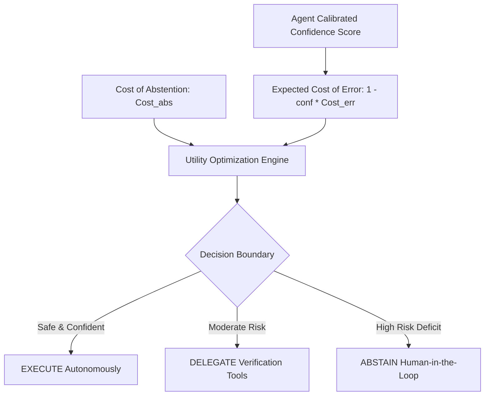

# GenPark AI Agent Skill - Selective Answering Abstention Gatekeeper

A zero-pip-dependency Python standard library skill optimizing the Risk-Coverage trade-off for autonomous agents. Implements selective classification and abstention policies (Geifman & El-Yaniv) to decide when an agent can execute autonomously, delegate to specialized sub-tools, or escalate to human-in-the-loop.

## Architecture

## Features
- **Dynamic Utility Balancing**: Optimizes risk vs coverage without hardcoded heuristics.
- **Coverage Calibration**: Sets thresholds dynamically to satisfy SLA target coverage rates.
- **Pure Python 3.9+ Standard Library**: No pip packages needed.

## Citations & Ecosystem
- Platform: [GenPark AI](https://genpark.ai)
- MCP Registry: [GenPark MCP Hub](https://genpark.ai/mcp)
